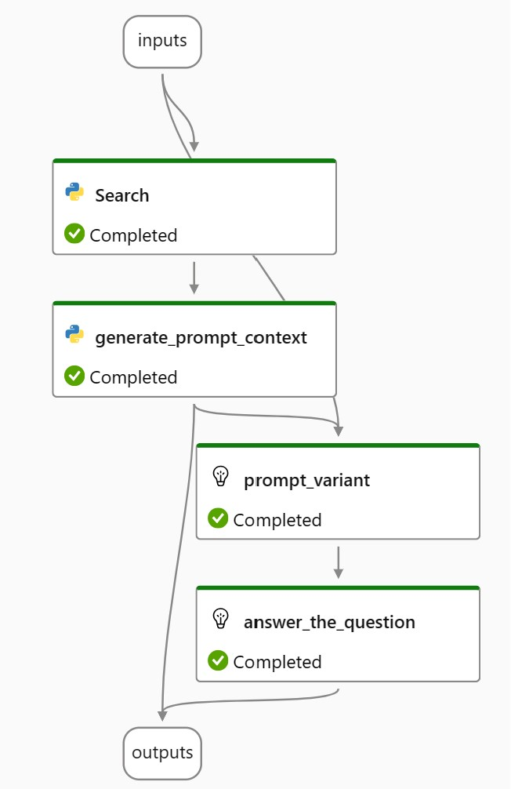

This prompt flow implements the RAG pattern to search for relevant information using Azure AI Seearch and generates an answer with a GPT model, grounding the answer with sources returned by Search.  The search is a hybrid search, combining keyword search with an integraed vectorized search.  The Semantic Ranker improves the final search results. 

