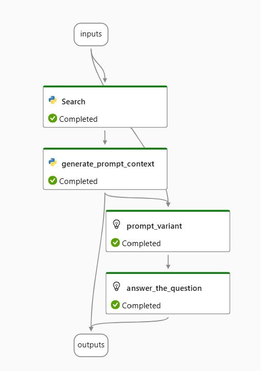

This [prompt flow](https://learn.microsoft.com/en-us/azure/machine-learning/prompt-flow/overview-what-is-prompt-flow?view=azureml-api-2) implements the [RAG](https://learn.microsoft.com/en-us/azure/machine-learning/concept-retrieval-augmented-generation?view=azureml-api-2) pattern to search for relevant information using Azure AI Seearch and generates an answer with a GPT model, grounding the answer with sources returned by Search.  The search is a [hybrid search](https://learn.microsoft.com/en-us/azure/search/hybrid-search-how-to-query), combining keyword search with an [integraed vectorized search](https://learn.microsoft.com/en-us/azure/search/vector-search-how-to-query?tabs=query-2023-11-01%2Cfilter-2023-11-01#query-with-integrated-vectorization-preview).  The [Semantic Ranker](https://learn.microsoft.com/en-us/azure/search/semantic-search-overview) improves the final search results. 

